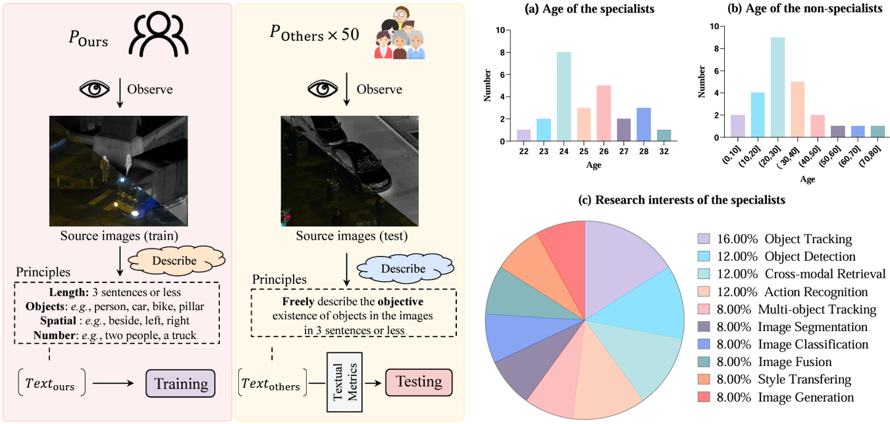

# TextFusion
This is the offical implementation for the paper titled "TextFusion: Unveiling the Power of Textual Semantics for Controllable Image Fusion". [Paper Link](https://arxiv.org/abs/2312.14209)

<div align="center">
  
  <p>"To generate appropriate fusion results for a specific scenario, existing methods cannot realize it or require expensive retraining. 
    The same goal can be achieved by simply adjusting the focused objectives of textual description in our paradigm."</p>
</div>

## Highlight
- **For the first time**, the text modality is introduced to the image fusion field.
- A benchmark dataset.
- A textual attention assessment.

## IVT dataset
<div align="center">
  
  <p>"Statistic information of the proposed dataset."</p>
</div>

Train Set [Images&Text]: [Google Drive](https://drive.google.com/file/d/1poc5sWwAY63zNnxlTAPSJZLNml75k6aK/view?usp=sharing)

Train Set [Pre-gen Association Maps]: [Google Drive](https://drive.google.com/file/d/1Z9as1GZgoSem-FqRDlBW2YYwVyr8Wfgr/view?usp=sharing)

Test Set: [Google Drive](https://drive.google.com/drive/folders/1a5fAg5wDYW0ZrIpaFPVR948zdmuAe2jQ?usp=sharing)

## The propose model

Folder structure:
```
/dataset
--/IVT_train
----/ir
------/1.png
----/vis
------/1.png
----/text
------/1_1.txt
----/association
------/IVT_LLVIP_2000_imageIndex_1_textIndex_1
--------/Final_Finetuned_BinaryInterestedMap.png
/TextFusion
--/main_trainTextFusion.py
--/net.py
--/main_test_rgb_ir.py
```

### To train
Assuming that you already have  (download from above links) the pre-gen association map, images, and corresponding textual description in the "IVT_train" folder.

Simply run the following prompt to start the training process:
```
python main_trainTextFusion.py
```

The trained models and corresponding loss values will be saved in the "models" folder.

(The code to generate the association map on your own is available in this [repository](https://github.com/AWCXV/TextFusion-Association_for_Training))

### To test
For the RGB and infrared image fusion (e.g., LLVIP):
```
python main_test_rgb_ir.py
```
**Tips**: If you are comparing our TextFusion with a pure apperance-based method, you can directly set the "description" as empty for a relative fair experiment.

For the grayscale and infrared image fusion (e.g., TNO):

```
python main_test_gray_ir.py
```

## Environment
- Python 3.8.3
- Torch 2.1.2
- torchvision 0.16.2
- opencv-python 4.8.1.78
- tqdm 4.66.5
- ftfy 6.2.3
- regex
- matplotlib
- timm


## Update
- 2024-4-30: The codes for generating the association maps are available now!
- 2024-3-14: The training code is available and corresponding pre-gen association maps are uploaded to the Google Drive.
- 2024-3-5: The testing set of our IVT dataset is available now.
- 2024-2-8: The training set of our IVT dataset is available now.
- 2024-2-12: The pre-trained model and test files are available now!
- 2024-11-10: This work has been accepted by Information Fusion.

## Contact Informaiton
If you have any questions, please contact me at <chunyang_cheng@163.com>.

## Citation
If this work is helpful to you, please cite it as:
```
@article{cheng2023textfusion,
  title={TextFusion: Unveiling the Power of Textual Semantics for Controllable Image Fusion},
  author={Cheng, Chunyang and Xu, Tianyang and Wu, Xiao-Jun and Li, Hui and Li, Xi and Tang, Zhangyong and Kittler, Josef},
  journal={arXiv preprint arXiv:2312.14209},
  year={2023}
}
```

Our dataset is annotated based on the LLVIP dataset:
```
@inproceedings{jia2021llvip,
  title={LLVIP: A visible-infrared paired dataset for low-light vision},
  author={Jia, Xinyu and Zhu, Chuang and Li, Minzhen and Tang, Wenqi and Zhou, Wenli},
  booktitle={Proceedings of the IEEE/CVF international conference on computer vision},
  pages={3496--3504},
  year={2021}
}
```
